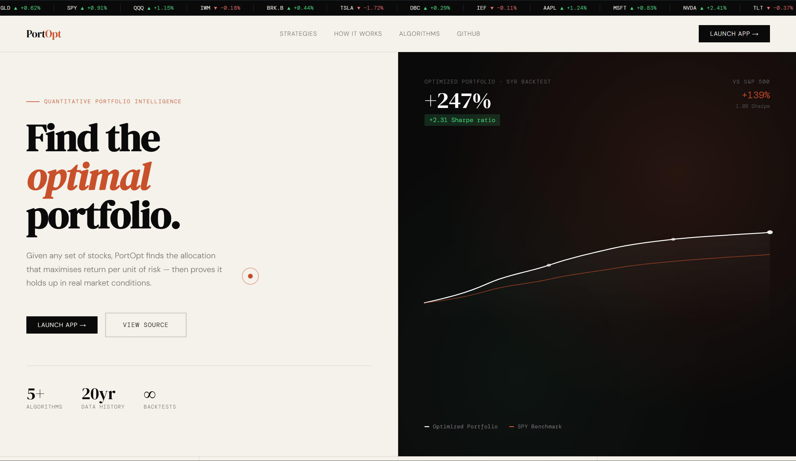
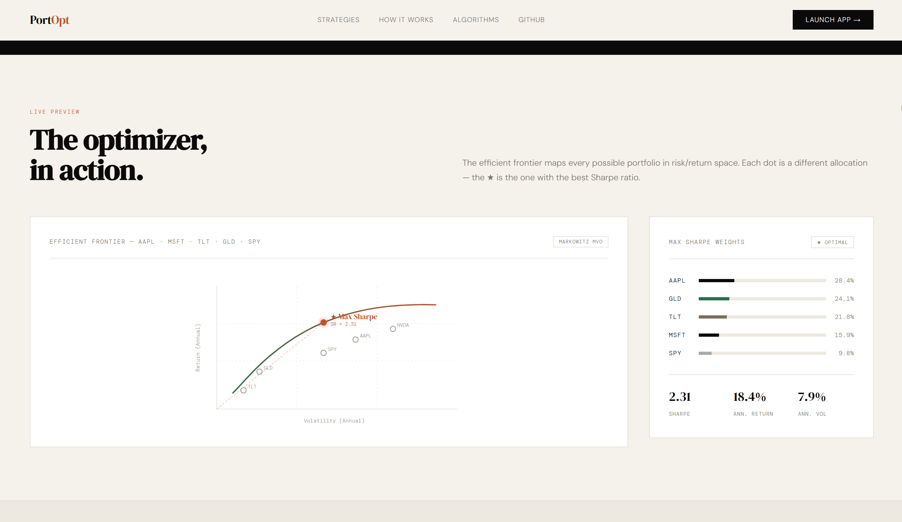

# PortOpt

**Given any set of stocks, find the allocation that maximises return per unit of risk — then prove it holds up.**

[](https://adityachauhanx07-port-opt.streamlit.app/)
[](https://adityachauhanx07.github.io/port-opt/)
[](LICENSE)

---



---

## What it does

Most investors either pick stocks by gut feel or dump everything into an index fund. PortOpt sits in between — it takes your chosen assets, estimates how they move relative to each other, and solves for the exact allocation where you get the most return for the risk you're taking. Then it backtests that portfolio across real market history, including through 2008, COVID, and the 2022 rate shock, so you can see whether the math actually holds.

It's not a trading platform. It's a research tool for asking better questions about risk and return.

---



---

## Algorithms

Five approaches, each with a different philosophy:

| Algorithm | What it does | When to use it |
|-----------|-------------|----------------|
| **Markowitz MVO** | Traces the full efficient frontier using mean-variance optimization with covariance shrinkage | Starting point for any analysis |
| **HRP** | Hierarchical Risk Parity — uses clustering instead of matrix inversion, making it robust to estimation error | When your return estimates feel uncertain |
| **Risk Parity** | Allocates so each asset contributes equally to total portfolio risk | Naturally defensive, good for mixed asset classes |
| **CVaR Minimization** | Minimizes the expected loss in the worst 5% of scenarios | When tail risk is the priority |
| **Robust MVO** | Ellipsoidal uncertainty sets on expected returns — finds portfolios that survive even when your estimates are wrong | Conservative, real-world oriented |

---

## Features

- **Data** — pulls adjusted prices from Yahoo Finance for any tickers, any date range, daily/weekly/monthly frequency
- **Efficient frontier** — interactive chart with every risk/return tradeoff plotted, max-Sharpe portfolio highlighted
- **Walk-forward backtest** — rolling rebalancing with configurable transaction costs and slippage, not just a static in-sample fit
- **Benchmarks** — automatic comparison against equal-weight, SPY, 60/40, and All Weather portfolios
- **IS/OOS split** — define an out-of-sample period and see if the strategy actually generalises
- **Monte Carlo** — GBM simulation with fan chart showing the 5th/25th/50th/75th/95th percentile paths
- **Bootstrap Sharpe CI** — block bootstrap to estimate whether your Sharpe ratio is statistically meaningful
- **Stress tests** — performance during the Global Financial Crisis, COVID crash, and 2022 rate shock
- **3D correlation globe** — Three.js visualisation of asset correlations
- **Sankey rebalancing flows** — see how weights shift between consecutive rebalance dates

---

## Stack

```
Python · NumPy · Pandas · CVXPY · Streamlit · Plotly · yfinance · SciPy · scikit-learn
```

CI via GitHub Actions. Deployed on Streamlit Community Cloud.

---

## Run locally

```bash
git clone https://github.com/AdityaChauhanX07/port-opt.git
cd port-opt
python -m venv .venv
.venv\Scripts\activate        # Windows
# source .venv/bin/activate   # macOS / Linux
pip install -r requirements.txt
streamlit run src/portopt/app/ui.py
```

Then open `http://localhost:8501`.

---

## Project structure

```
port-opt/
├── src/portopt/
│   ├── app/
│   │   └── ui.py           # Streamlit interface
│   └── core/
│       ├── data.py         # Price fetching and cleaning
│       ├── stats.py        # Returns, equity curves, drawdowns
│       ├── opt.py          # Frontier, HRP, CVaR, Risk Parity, Robust MVO
│       ├── risk.py         # VaR, CVaR, rolling Sharpe/Sortino
│       ├── mc.py           # Monte Carlo simulation
│       ├── hrp.py          # Hierarchical Risk Parity
│       └── backtest.py     # Static and walk-forward backtesting
├── tests/
├── index.html              # Landing page (GitHub Pages)
├── requirements.txt
└── runtime.txt
```

---

## Tests

```bash
pytest
```

---

*Not financial advice. This is a research and learning tool.*

---

MIT License © Aditya Chauhan
